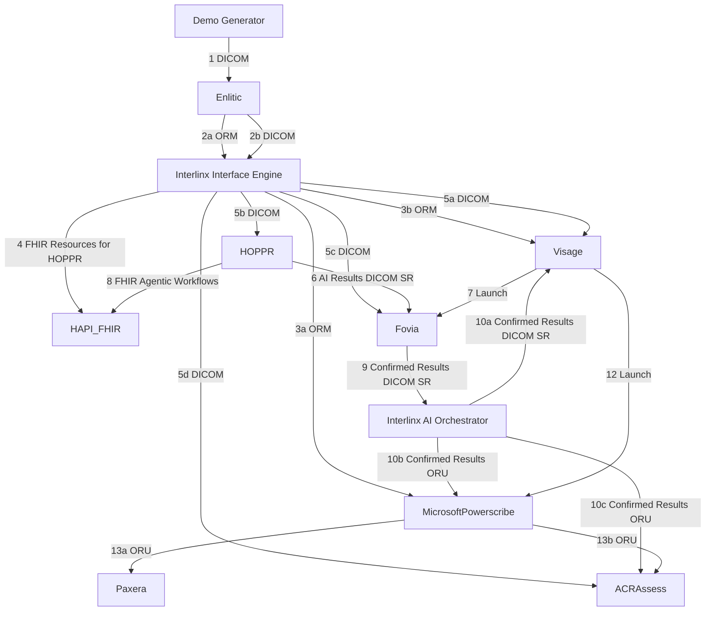

# Team Coolidge
## TBD Flow Chart

```mermaid
flowchart TD
    Generator[Demo Generator] --> |1 DICOM| Enlitic

    Enlitic --> |2a ORM| InterlinxIE[Interlinx Interface Engine]
    Enlitic --> |2b DICOM| InterlinxIE

    InterlinxIE --> |3a ORM| MicrosoftPowerscribe
    InterlinxIE --> |3b ORM| Visage

    InterlinxIE --> |4 FHIR Resources for HOPPR| HAPI_FHIR

    InterlinxIE --> |5a DICOM| Visage
    InterlinxIE --> |5b DICOM| HOPPR
    InterlinxIE --> |5c DICOM| Fovia
    InterlinxIE --> |5d DICOM| ACRAssess

    HOPPR --> |6 AI Results DICOM SR| Fovia

    Visage --> |7 Launch| Fovia

    HOPPR --> |8 FHIR Agentic Workflows| HAPI_FHIR

    Fovia --> |9 Confirmed Results DICOM SR| InterlinxAIO[Interlinx AI Orchestrator]

    InterlinxAIO --> |10a Confirmed Results DICOM SR| Visage
    InterlinxAIO --> |10b Confirmed Results ORU| MicrosoftPowerscribe
    InterlinxAIO --> |10c Confirmed Results ORU| ACRAssess

    Visage --> |12 Launch| MicrosoftPowerscribe

    MicrosoftPowerscribe --> |13a ORU| Paxera
    MicrosoftPowerscribe --> |13b ORU| ACRAssess
```
