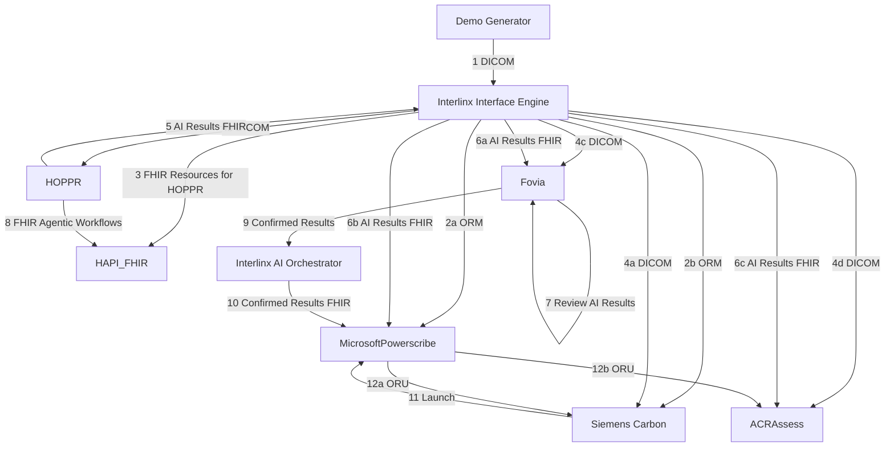

# Team Coolidge
## Abdominal CT Flow Chart

```mermaid
flowchart TD
    Generator[Demo Generator] --> |1 DICOM| InterlinxIE[Interlinx Interface Engine]

    InterlinxIE --> |2a ORM| MicrosoftPowerscribe
    InterlinxIE --> |2b ORM| Siemens[Siemens Carbon]

    InterlinxIE --> |3 FHIR Resources for HOPPR| HAPI_FHIR

    InterlinxIE --> |4a DICOM| Siemens
    InterlinxIE --> |4b DICOM| HOPPR
    InterlinxIE --> |4c DICOM| Fovia
    InterlinxIE --> |4d DICOM| ACRAssess

    HOPPR --> |5 AI Results FHIR| InterlinxIE

    InterlinxIE --> |6a AI Results FHIR| Fovia
    InterlinxIE --> |6b AI Results FHIR| MicrosoftPowerscribe
    InterlinxIE --> |6c AI Results FHIR| ACRAssess

    Fovia --> |7 Review AI Results| Fovia

    HOPPR --> |8 FHIR Agentic Workflows| HAPI_FHIR

    Fovia --> |9 Confirmed Results| InterlinxAIO[Interlinx AI Orchestrator]

    InterlinxAIO --> |10 Confirmed Results FHIR| MicrosoftPowerscribe
    
    Siemens --> |11 Launch| MicrosoftPowerscribe

    MicrosoftPowerscribe --> |12a ORU| Siemens
    MicrosoftPowerscribe --> |12b ORU| ACRAssess
```
