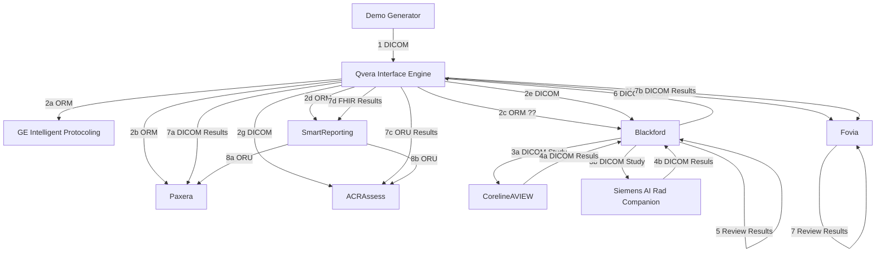

# Team Cormack
## Chest CT Flow Chart

```mermaid
flowchart TD
    Generator[Demo Generator] --> |1 DICOM| QveraIE[Qvera Interface Engine]

    QveraIE --> |2a ORM| GEIP[GE Intelligent Protocoling]
    QveraIE --> |2b ORM| Paxera
    %% Does Blackford want ORMs?!?
    QveraIE --> |2c ORM ??| Blackford
    QveraIE --> |2d ORM| SmartReporting
    QveraIE --> |2e DICOM| Blackford
    QveraIE --> |2f DICOM| Fovia
    QveraIE --> |2g DICOM| ACRAssess

    Blackford --> |3a DICOM Study| CorelineAVIEW
    Blackford --> |3b DICOM Study| SiemensAIRC[Siemens AI Rad Companion]

    CorelineAVIEW --> |4a DICOM Resuls| Blackford
    SiemensAIRC --> |4b DICOM Resuls| Blackford

    %% If Blackford has a good viewer. Maybe we review one study in their viewer? 
    Blackford --> |5 Review Results| Blackford

    Blackford --> |6 DICOM Resuls| QveraIE
    
    QveraIE --> |7a DICOM Results| Paxera
    QveraIE --> |7b DICOM Results| Fovia
    QveraIE --> |7c ORU Results| ACRAssess
    QveraIE --> |7d FHIR Results| SmartReporting
    
    %% Will we modify the results and broadcast the updated version? Opporunity for AIRAI
    Fovia --> |7 Review Results| Fovia
    
    %% Combine results from both AI models into one report
    SmartReporting --> |8a ORU| Paxera
    SmartReporting --> |8b ORU| ACRAssess
```
