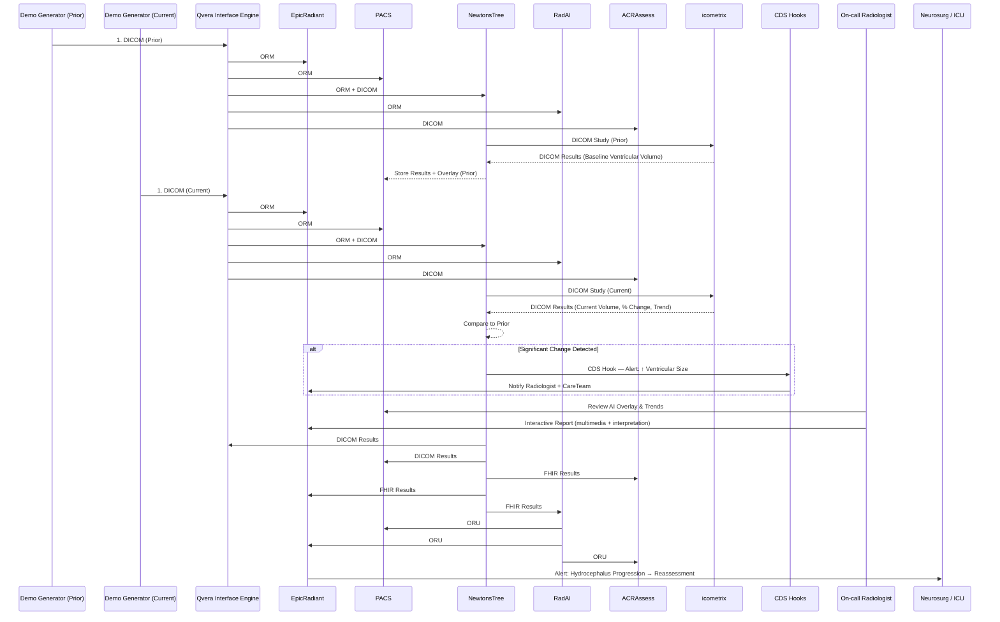

# Team Lauterbur
## Brain CT Sequence Diagram

```mermaid
sequenceDiagram
    participant Gen1 as Demo Generator (Prior)
    participant Gen2 as Demo Generator (Current)
    participant QveraIE as Qvera Interface Engine
    participant Epic as EpicRadiant
    participant PACS as PACS
    participant NT as NewtonsTree
    participant RadAI as RadAI
    participant ACR as ACRAssess
    participant iCo as icometrix
    participant CDS as CDS Hooks
    participant Radiologist as On-call Radiologist
    participant CareTeam as Neurosurg / ICU

    %% First CT (baseline)
    Gen1->>QveraIE: 1. DICOM (Prior)
    QveraIE->>Epic: ORM
    QveraIE->>PACS: ORM
    QveraIE->>NT: ORM + DICOM
    QveraIE->>RadAI: ORM
    QveraIE->>ACR: DICOM

    NT->>iCo: DICOM Study (Prior)
    iCo-->>NT: DICOM Results (Baseline Ventricular Volume)
    NT-->>PACS: Store Results + Overlay (Prior)
    
    %% Second CT (follow-up)
    Gen2->>QveraIE: 1. DICOM (Current)
    QveraIE->>Epic: ORM
    QveraIE->>PACS: ORM
    QveraIE->>NT: ORM + DICOM
    QveraIE->>RadAI: ORM
    QveraIE->>ACR: DICOM

    NT->>iCo: DICOM Study (Current)
    iCo-->>NT: DICOM Results (Current Volume, % Change, Trend)

    %% Review & CDS logic
    NT-->>NT: Compare to Prior
    alt Significant Change Detected
        NT->>CDS: CDS Hook — Alert: ↑ Ventricular Size
        CDS->>Epic: Notify Radiologist + CareTeam
    end

    %% Radiologist follow-up
    Radiologist->>PACS: Review AI Overlay & Trends
    Radiologist->>Epic: Interactive Report (multimedia + interpretation)
    
    %% Structured communication
    NT->>QveraIE: DICOM Results
    NT->>PACS: DICOM Results
    NT->>ACR: FHIR Results
    NT->>Epic: FHIR Results
    NT->>RadAI: FHIR Results

    RadAI->>PACS: ORU
    RadAI->>Epic: ORU
    RadAI->>ACR: ORU

    Epic->>CareTeam: Alert: Hydrocephalus Progression → Reassessment

```
