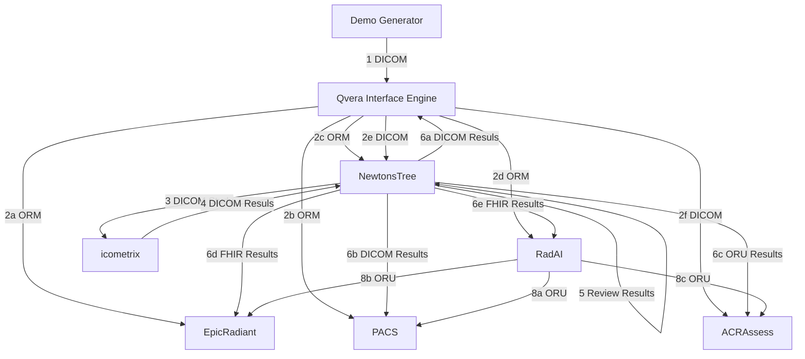

# Team Lauterbur
## Brain CT Flow Chart

```mermaid
flowchart TD
    Generator[Demo Generator] --> |1 DICOM| QveraIE[Qvera Interface Engine]

    QveraIE --> |2a ORM| EpicRadiant
    QveraIE --> |2b ORM| PACS
    QveraIE --> |2c ORM| NewtonsTree
    QveraIE --> |2d ORM| RadAI
    QveraIE --> |2e DICOM| NewtonsTree
    QveraIE --> |2f DICOM| ACRAssess

    NewtonsTree --> |3 DICOM Study| icometrix

    icometrix --> |4 DICOM Resuls| NewtonsTree

    %% AI results reviewed on the screen - Newtons Tree can do this as a blocking or parallel step
    NewtonsTree --> |5 Review Results| NewtonsTree

    NewtonsTree --> |6a DICOM Resuls| QveraIE
    NewtonsTree --> |6b DICOM Results| PACS
    NewtonsTree --> |6c ORU Results| ACRAssess
    NewtonsTree --> |6d FHIR Results| EpicRadiant
    NewtonsTree --> |6e FHIR Results| RadAI

    %% Could send FHIR results over FHIRcast
    
    %% TODO Where do CDS hooks go and what do they look like here?!?

    %% Assuming we choose to report this study - maybe do FHIR?
    %% TODO: Feature IHE IDR
    RadAI --> |8a ORU| PACS
    RadAI --> |8b ORU| EpicRadiant
    RadAI --> |8c ORU| ACRAssess
```
