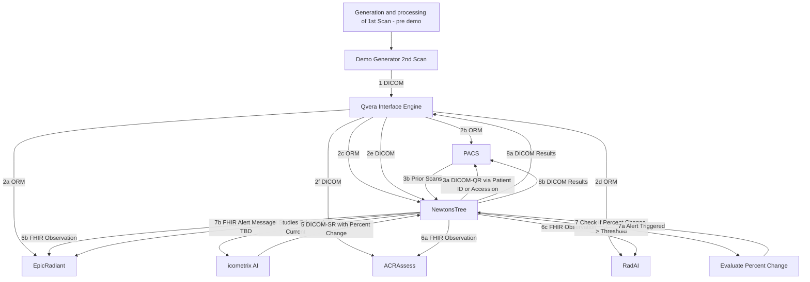

# Team Lauterbur
## Brain CT Flow Chart

See [clinical scenario](https://docs.google.com/document/d/1AbMGfBinw8_epP9_cIjC8s-tYXvqS_8XI4lB4wp4Qxc/edit?tab=t.0#heading=h.bxasmyukr250)

```mermaid
flowchart TD
    Gen1[Generation and processing of 1st Scan - pre demo] --> Gen2
    %% Current CT acquisition
    Gen2[Demo Generator 2nd Scan] --> |1 DICOM| QveraIE[Qvera Interface Engine]
    QveraIE --> |2a ORM| Epic[EpicRadiant]
    QveraIE --> |2b ORM| PACS[PACS]
    QveraIE --> |2c ORM| NT[NewtonsTree]
    QveraIE --> |2d ORM| RadAI[RadAI]
    QveraIE --> |2e DICOM| NT
    QveraIE --> |2f DICOM| ACR[ACRAssess]

    %% Prior scan retrieval
    NT --> |3a DICOM-QR via Patient ID or Accession| PACS
    PACS --> |3b Prior Scans| NT

    %% Send all scans to icometrix
    NT --> |4 All Studies Prior and Current| iCo[icometrix AI]
    iCo --> |5 DICOM-SR with Percent Change| NT

    %% FHIR Reporting and Alerting
    NT --> |6a FHIR Observation| ACR
    NT --> |6b FHIR Observation| Epic
    NT --> |6c FHIR Observation| RadAI

    NT --> |7 Check if Percent Change > Threshold| AlertCheck[Evaluate Percent Change]
    AlertCheck --> |7a Alert Triggered| NT
    NT --> |7b FHIR Alert Message TBD| Epic

    %% Optional results distribution
    NT --> |8a DICOM Results| QveraIE
    NT --> |8b DICOM Results| PACS
```
