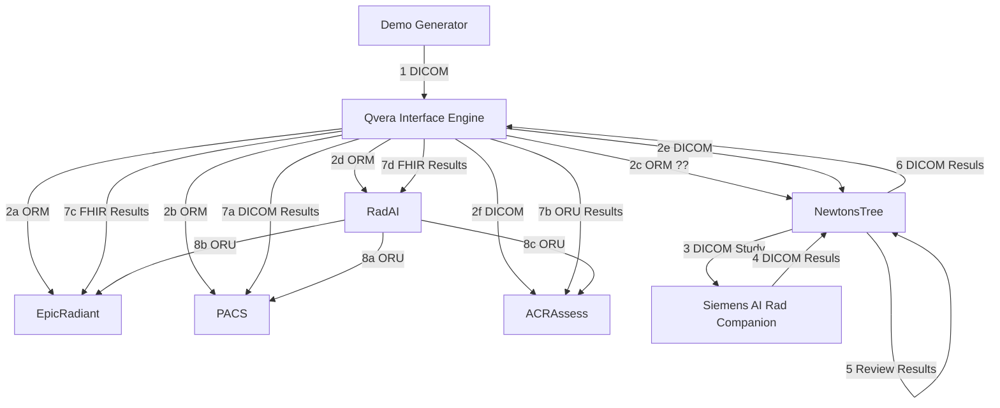

# Team Lauterbur
## Brain MR Flow Chart

```mermaid
flowchart TD
    Generator[Demo Generator] --> |1 DICOM| QveraIE[Qvera Interface Engine]

    QveraIE --> |2a ORM| EpicRadiant
    QveraIE --> |2b ORM| PACS
    %% Does Newton's Tree want ORMs?!?
    QveraIE --> |2c ORM ??| NewtonsTree
    QveraIE --> |2d ORM| RadAI
    QveraIE --> |2e DICOM| NewtonsTree
    QveraIE --> |2f DICOM| ACRAssess

    NewtonsTree --> |3 DICOM Study| SiemensAIRC[Siemens AI Rad Companion]

    SiemensAIRC --> |4 DICOM Resuls| NewtonsTree

    %% AI results reviewed on the screen
    NewtonsTree --> |5 Review Results| NewtonsTree

    NewtonsTree --> |6 DICOM Resuls| QveraIE

    QveraIE --> |7a DICOM Results| PACS
    QveraIE --> |7b ORU Results| ACRAssess
    QveraIE --> |7c FHIR Results| EpicRadiant
    QveraIE --> |7d FHIR Results| RadAI

    %% Assuming we choose to report this study
    RadAI --> |8a ORU| PACS
    RadAI --> |8b ORU| EpicRadiant
    RadAI --> |8c ORU| ACRAssess
```
