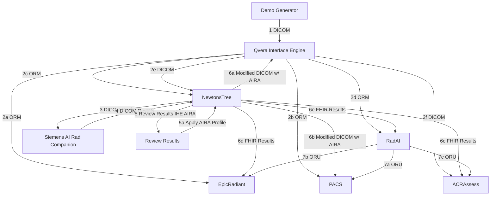

# Team Lauterbur
## Brain MR Flow Chart

Requires multiple findings, one or more of which are modified or rejected, to implement [AIRA profile](https://www.ihe.net/uploadedFiles/Documents/Radiology/IHE_RAD_Suppl_AIRA.pdf).

